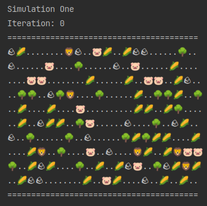

# Дневник разработки проекта "Симуляция"

## 05.11.24 Вечер
Посмотрел лекцию про [декомпозицию](https://www.youtube.com/live/3ox5DI_xAog). 
Интуитивное понятие декомпозиции у меня было, лекция помогла его формализовать. 

Хорошая новость MVP у меня уже есть.

Вторая хорошая новость я знаю как двигаться дальше. Сначала реализую поиск в 
ширину без учета движения, если существо доходит до цели оно его сразу и съедает.
Учет шагов и жизней существ отложу до следующих итераций.

Сначала не мог понять причем тут поиск в ширину и двумерный массив, потом понял 
что двумерный массив является разновидностью графа центральные вершины которого 
соединены с 8-ю соседними, боковые с 5-ю, а угловые с 3-мя.

Также я предполагаю что на данном этапе игровой условность является то, что хищник 
не может пройти через клетку с травой. Немного нелогично, но данная проблема исчезнет
когда появится возможность помещать в ячейку поля несколько сущностей.

Мне не нравиться, что при консольном выводе, справа от игрового поля остается пустое пространство.
Сначала думал использовать его, чтобы выводить несколько симуляций в один ряд, но данная
задача требует построчного разбиения строк изображения по символу переноса строки и слияния 
полученных массивов в один массив с последующим объединение ячеек полученного массива 
символами переноса строки. Еще остаются моменты когда высота правого поля больше высоты 
левого. Должно получиться красиво, но в некоторых случаях бесполезно, например когда стимулируются широкие поля.

Другой вариант использования пустого правого пространства - вывод информации о ходе симуляции, например 
+ Лев (2, 4) -> Свин(2, 6)
+ Свин(4, 6) -> Трава(3, 5) 
+ Свин(5, 9) -> ... (6, 7) // остановился, тут как раз актуально изображение пустого пространства 

Задача кажется мне простой, помещать сообщения о ходе симуляции в очередь, а при подготовке 
изображения строки поля брать сообщения из очереди и добавлять его к текущей строке.

Задачи на следующую итерацию мне ясны:
1. Поиск в ширину без учета движения
2. Сообщения о ходе симуляции
3. Отображение травы, травоядных и хищников в заголовке симуляции

## 05.11.24

_Привет, Дневник! Меня зовут Евгений, живу в городе Краснодаре. 
Решил попробовать тебя вести._  **;-)**

Хранение дневника разработки в файлах проекта кажется удачной идеей. Быстрый доступ,
синхронизация и как оказалось проверка орфографии, являются важными для меня моментами.
Markdown разметка тоже приятное дополнение.

О групповой работе над проектами узнал недавно, ранее в подобных
активностях не участвовал, запрыгнул так сказать в последний вагон.

### Позавчера

пришла ссылка на групповой чат и я прочитал ТЗ
проекта, просмотрел видео разборы ревью завершенных проектов, частично
просмотрел стримы реализации аналогичного проекта шахматы в ООП стиле.
До получения ссылки я сомневался что в настоящее время возможна какая-либо
серьезная бесплатная активность.

Просматривая стрим и ревью меня не покидала мысль, что изображения тоже является
абстракцией сущности (Entity). Не символ или путь к файлу, а именно идея, что сущность
может как-то себя представлять. Мне кажется класс String является хорошей реализацией
данной идеи, помимо того что в него можно сериализовать любой объект, в том числе
поток байтов, или в простейшем случае можно поместить несколько символов (буквы,
цифры, псевдографику, emoji и др.) для консольного вывода.

Класс Simulation также поддерживает идею изображения абстрактными методами
__T getImage()__ и __List\<Runnable\> getFirstSpawnActions()__ для консольного вывода
реализованными в классе __SimulationForConsoleRender extends Simulation\<String\>__
рендер при этом получился простейший - __sout__.

### Вчера

накануне группового созвона получил первый понравившийся консольный вывод.
Уже вижу, что хорошо бы дополнить вывод информацией о количестве травы, травоядных и хищников.

С помощью управляющих ANSI последовательностей передвижения курсора "\033[n;mG"
попытался вывести отображение трех симуляций в один ряд, **не получилось**.
Очистка экрана "\033[H\033[2J" тоже **не работает**, хотя цвета меняются.
Возможно дело в настройках Ubuntu-терминала, решил пока не заморачиваться с этим вопросом.

### Шаги

Сейчас вижу следующие шаги

1. реализация поиска пути
2. передвижение без учета атаки
3. учет атаки хищников при передвижении
4. управление симуляцией
5. многопоточный запуск

### Идеи

Сейчас у меня следующие идеи

* возможность помещать в ячейку поля несколько сущностей
* управление и отображение нескольких симуляций
* генерация статичных сущностей в виде лабиринта
* размножение сущностей interface reproducible
* старение, голод 